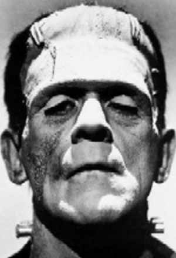
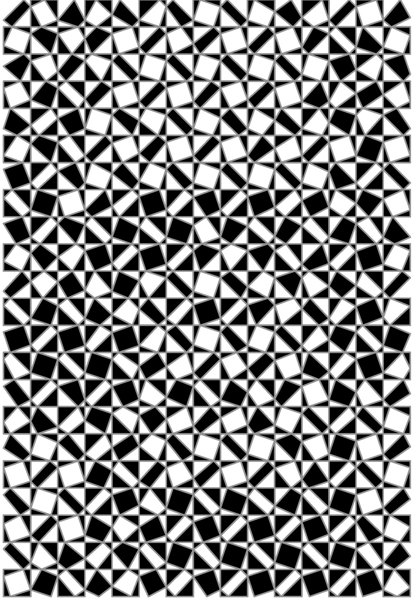

# Quadrilateral Tile Image Matching with Genetic Algorithms

This is the code for our final project in nonlinear optimization. The base of the code and original idea was contributed by our professor **Bob Bosch** (http://www.dominoartwork.com/). We have modified it and expanded the crossover methods for testing.

This code will attempt to create a image similar to a given image in data file format out of black and white quadrilateral tiles.

If you want to try it on your own I made a makefile. Use cd to navigate to the folder. Just go to terminal, cd into the folder by typing:

cd <name of folder>

into terminal and then type

make

into terminal. You will get a lot of warnings from the rans.c file but dont worry. Then simply type

./ga_quads

and it will run for 100000 iterations. This will take a min or two. Once done, go to file explorer and double click on ga_quads.eps in the folder to see final image. 

Before and After of first trial

